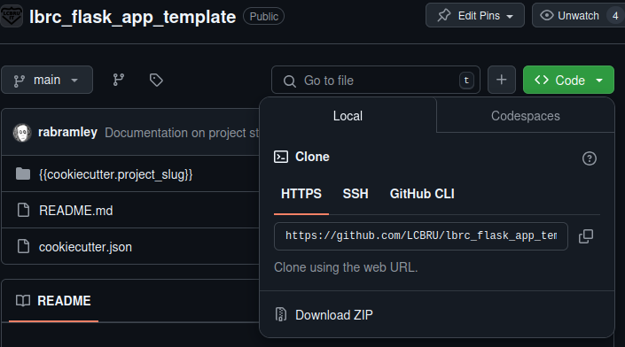

# LBRC Flask App Template
This is a template for Flask applications using the NIHR Leicester Beoimedical Research Centre
theme and standard toolset.
## Cookie Cutter
This template uses cookie cutter to create the project.  See the documentation for further [details](https://cookiecutter.readthedocs.io/en/stable/index.html) about cookiecutter.
### Install Cookie Cooker
To install cookie cutter run the command:
```bash
pip3 install --user cookiecutter
```
## Generate Project from Template
Cookiecutter downloads the template from GitHub and uses it to create
your new project.  Use the link shown in the repositories from the `Code` button.


```bash
# Using the https github link
cookiecutter https://github.com/LCBRU/lbrc_flask_app_template.git
# Using the the GitHub CLI link
cookiecutter gh:LCBRU/lbrc_flask_app_template
```
## Setting up the new Project
1. Change directory into the project directory
2. Create a python virtual environment using the command `python3 -m venv .venv`
3. Activate the python virtual environment using the command `. .venv/bin/activate`
4. Upgrade *pip*: `pip install --upgrade pip`
5. Install *pip-tools*: `pip install pip-tools`
6. Create a requirements file from `requirements.in` by running the command: `pip-compile`
7. Install the requirements using the command: `pip install -r requirements.txt`
8. Create a blank database using the details entered into cookie cutter
9. Create test data by running `python create_test_db.py`
10. Run the application: `python app.py`
